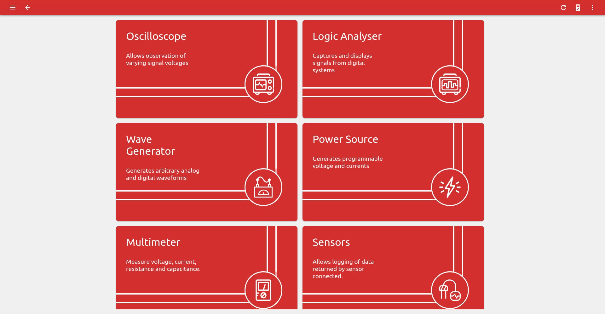
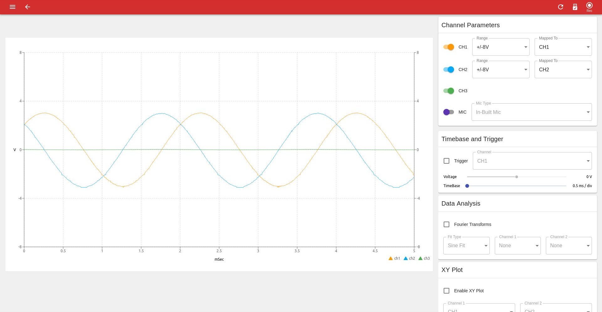
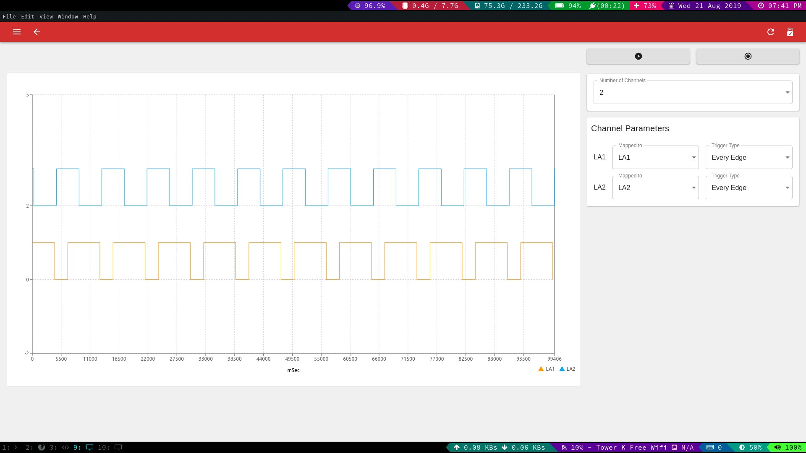
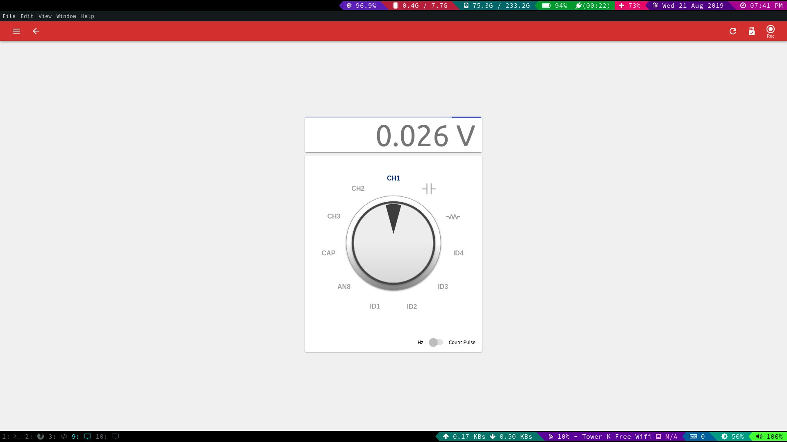
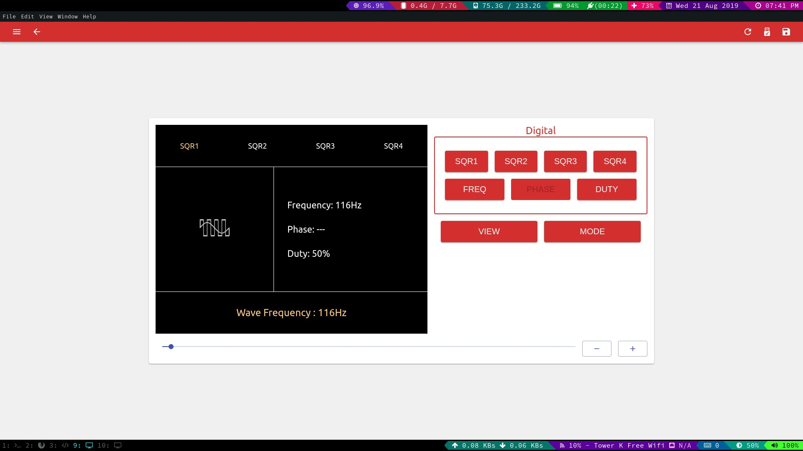
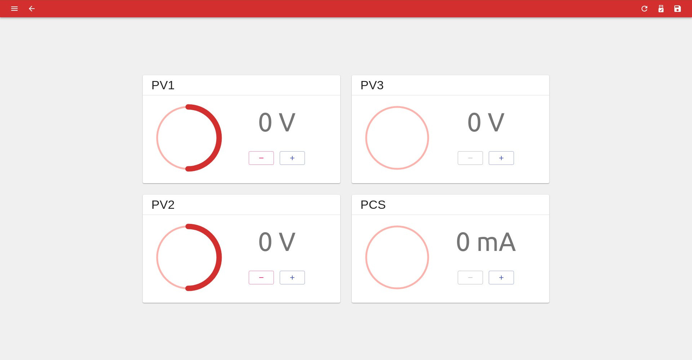
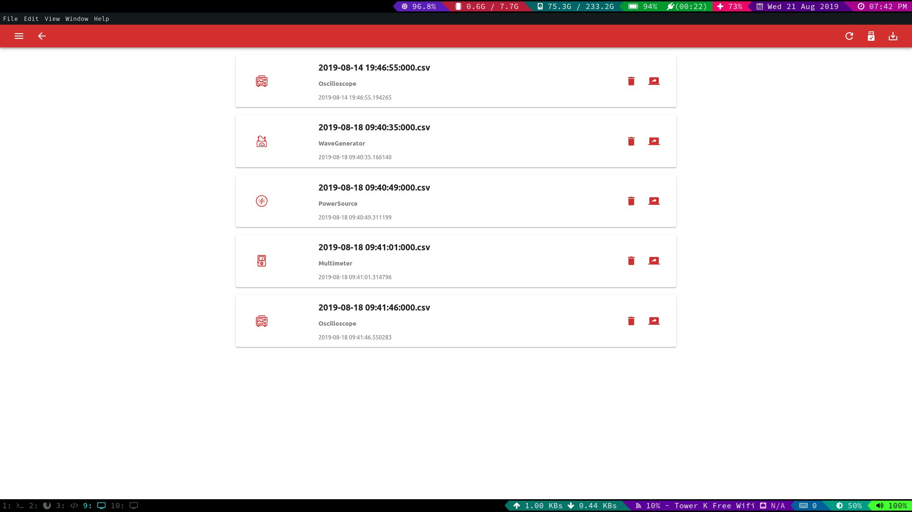

# PSLab Desktop

Desktop application for the [Pocket Science Lab (PSlab)](https://pslab.io) open hardware platform.

Development [](https://travis-ci.org/fossasia/pslab-desktop)
Master [](https://travis-ci.org/fossasia/pslab-desktop)
[](https://www.codacy.com/app/mb/pslab-desktop?utm_source=github.com&amp;utm_medium=referral&amp;utm_content=fossasia/pslab-desktop&amp;utm_campaign=Badge_Grade)
[](https://groups.google.com/forum/#!forum/pslab-fossasia)
[](https://gitter.im/fossasia/pslab?utm_source=badge&utm_medium=badge&utm_campaign=pr-badge)
[](https://twitter.com/pslabio)

The PSlab-Desktop repository holds the PSLab Desktop application. It is using ElectronJS running ReactJS on top as UI renderer and uses Python scripts under the hood for device communication. The goal of PSLab is to create an Open Source hardware device (open on all layers) and software applications that can be used for experiments by teachers, students and scientists. Our tiny pocket lab provides an array of instruments for doing science and engineering experiments. It provides functions of numerous measurement tools including an oscilloscope, a waveform generator, a frequency counter, a programmable voltage, current source and even a component to control robots with up to four servos. Our website is at: https://pslab.io

<a href="https://pslab.io/" rel="PSLab">
	
</a> 

# Communication

Please join us on the following channels:
* [Pocket Science Channel](https://gitter.im/fossasia/pslab)
* [Mailing List](https://groups.google.com/forum/#!forum/pslab-fossasia)

# Project Overview
A number of instruments have already been implemented.

### 1. User Interface
The UI has been desgined to match the existing android app so that the user does not have to invest time on understanding the desktop app from scratch.


### 2. Oscilloscope
A four channel oscilloscope with a 25FPS refresh rate. Comes with features like variable time-base, fourier transform, sine/square fitting and XY plotting.


### 3. Logic Analyzer
A four channel logic analyser. It supports variable edge detection modes for the user to analyze digital waveforms.    


### 4. Multimeter
It can be used to measure voltage, resistance, capacitance, wave frequency etc.


### 5. Wave generator
This can be used to generate sine/triangular and PWM waves of different frequencies and phase angles.  


### 6. Power source
Three programmable voltage sources and one programmable current source that can be used to power external circuits.


### 7. Robotic arm
A neat UI that can be used to program four servo motors ( placed in a robotic arm ) using a timeline.


### 8. Data logger
Data can be captured and saved in a CSV file. We also have a playback feature in place that lets the user replay the data from the CSV file.  


# Features and Implementation Status

|   **Feature**          | **Description**                                                   | **Status**         |
|------------------------|-------------------------------------------------------------------|--------------------|
| Home Screen            | Show status and version of PSLab device                           | :heavy_check_mark: |
| Instruments            | Exposes PSLab instruments like Oscilloscope, etc                  | :heavy_check_mark: |
| Oscilloscope           | Shows variation of analog signals                                 | :heavy_check_mark: |
| Multimeter             | Measures voltage, current, resistance and capacitance             | :heavy_check_mark: |
| Logical Analyzer       | Captures and displays signals from digital system                 | :heavy_check_mark: |
| Wave Generator         | Generates arbitrary analog and digital waveforms                  | :negative_squared_cross_mark: |
| Power Source           | Generates programmable voltage and currents	                     | :heavy_check_mark: |
| Lux Meter              | Measures the ambient light intensity                              | :negative_squared_cross_mark: |
| Barometer              | Measures the Pressure                                             | :negative_squared_cross_mark: |
| Accelerometer          | Measures the acceleration of the device                           | :negative_squared_cross_mark: |
| Gyrometer              | Measures the rate of rotation                                     | :negative_squared_cross_mark: |
| Compass                | Measures the absolute rotation relative to earth magnetic poles   | :negative_squared_cross_mark: |
| Thermometer            | Measures the ambient temperature                                  | :negative_squared_cross_mark: |
| Gas Sensor             | Detects gases, including NH3, NOx, alcohol, benzene, smoke and CO2| :negative_squared_cross_mark: |
| Robotic Arm Controller | Allows to control 4 servo motors of the robotic arm independently | :heavy_check_mark: |

# Roadmap
The goal of the project is to provide a fully functional science application that works with PSLab and other open scientific hardware. Furthermore the application should be fully compatible and feature matching to the PSLab Android app. Current status of the development:
* [x] Implement all major instruments
* [x] Have an effective build system for linux and windows
* [x] Have a basic data logging feature in place
* [ ] Implement interface for I<sup>2</sup>C sensors
* [ ] Implement more minor instruments 
	- [ ] Lux meter
	- [ ] Gas meter
	- [ ] Compass
	- [ ] pH meter
	- [ ] Accelerometer
	- [ ] Barometer 
* [ ] Make data logging and playback more robust
* [ ] Code refactoring and architecture improvement

# How to Contribute
Great you are interested in contributing! Please check the issue tracker for open bugs and feature requests and read the [community guidelines](https://blog.fossasia.org/open-source-developer-guide-and-best-practices-at-fossasia/) of FOSSASIA to start.

# Branch Policy

* The **development** branch holds is the standard branch of the project. PRs are merged to this branch and tested on an ongoing basis.
* The **master** branch holds the stable version of the project and merges the development branch regularly after it is tested thouroughly.
* The **install** install branch holds autogenerated install images for Linux and Windows. It is generated through using a Travis script and created automatically on merged PRs in the dev and master branch.
* The **gh-pages** is currently outdated, but is intended to hold information of the project from the Readme.md and /docs folder.

# How to Install
The [install](https://github.com/fossasia/pslab-desktop/tree/install) branch of the PSLab-Desktop repository hosts all the installers that we support for different desktop platforms. You can either install the app directly from the debian .deb package file or windows installer file. "Stable installers" are generated and updated on a weekly basis and are created from the **master** branch automatically. "Development Installers" are generated and updated on every PR merged on from the **development** branch. These installers are used for testing purpose. 
		  
## How to Install on Linux
Download the .deb file from the install branch and click the file to open it using your package manager or use the following commands in your terminal:
```bash
sudo dpkg -i <deb-file-name>
```
For testing purpose, you can install the snap package generated by the above command using:
```bash
sudo snap install --dangerous --classic <snap-package-name>
```
## How to Install on Windows
Download the windows files from the install branch and execute the file to install the system on your Windows machine.

# How to Setup the Project from Source on Your Development Environment
1. Fork the project to get a copy of the repository in your github profile.
2. Clone the copied project from your profile ( Not the original repository from FOSSASIA ).
3. ```cd``` into your project folder.
4. ```git remote add upstream https://github.com/fossasia/pslab-desktop.git``` This command will set up the upsteam link.

**Installing development dependencies**

While in your project folder
```bash
npm install
```
This command will install all the necessary dependencies required by the electron app to run. As this app uses the **PSL** library under the hood for device communication, you'll have to install it as well. The instructions to install it are provided [here](https://github.com/fossasia/pslab-python). After installation of **PSL** make sure you can property import it in **Python3**. Run the following command in your bash shell.
```bash
python3
>>> from PSL import sciencelab
```
If this command runs without throwing an error, then you are good to go.

**Starting the app**

All commands to start and debug the app are outlined in the package.json. To simply get it running run the following command while in your project repository.
```bash
npm start
```
And wait for the electron shell to open. 

# Creating Production Builds
We are generating production builds automatically in the install branch of the project. The build pipeline generates a **debian** file that can be installed on any debian based distro. A .win file is generated as well. You can also build the files yourself.

## How to build for Linux (Debian based OS)
While in the project root  
```bash
npm run build-linux
```  
## How to build for Windows
While in the project root  
```bash
npm run build-windows
```
This command will produce a **build** and a **dist** directory inside the project folder. The **build** folder contains the optimized react files, while the **dist** folder contains the final electron installers. 

## How to build for other platforms
While in the project root  
```bash
npm run build
```

# License
This project is Free and Open Source software. The project us licensed under the [GPL v3](LICENSE). Copyright is owned by FOSSASIA. More details in the license files.

# Maintainers
The project is maintained by
- Padmal ([@CloudyPadmal](https://github.com/CloudyPadmal))
- Mario Behling ([@mariobehling](http://github.com/mariobehling))
- Wei Tat ([@cweitat](https://github.com/cweitat))
