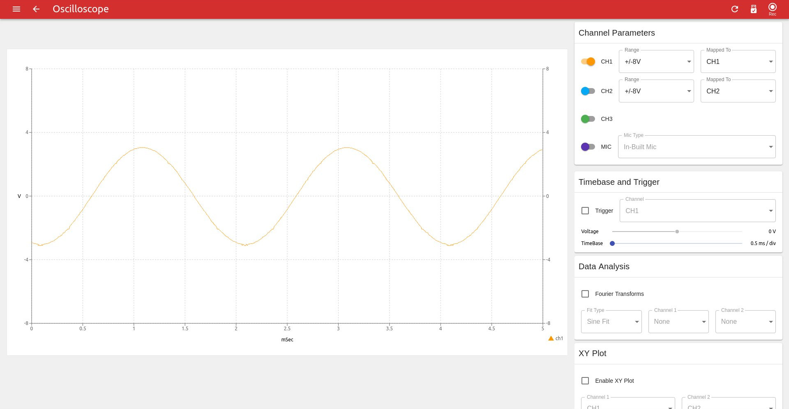
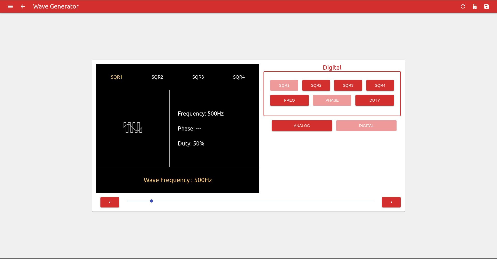
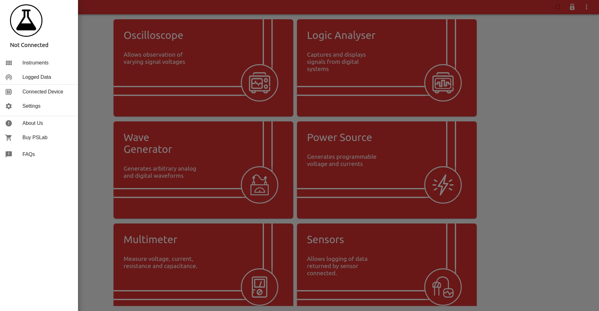
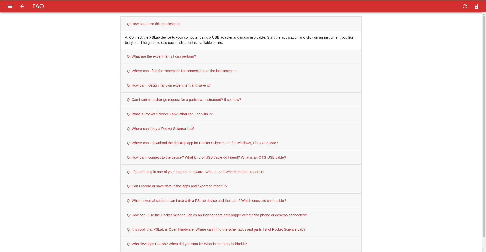
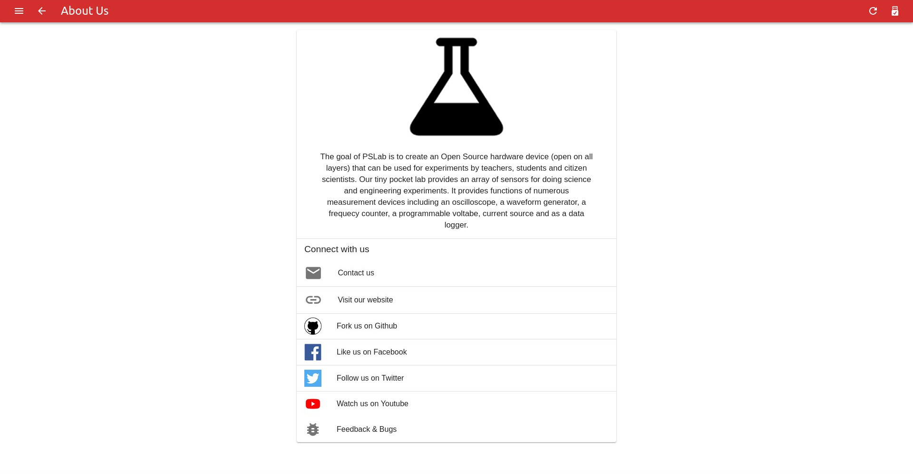

# PSLab Desktop

Desktop application for the [Pocket Science Lab (PSlab)](https://pslab.io) open hardware platform.

Development [](https://travis-ci.org/fossasia/pslab-desktop)
Master [](https://travis-ci.org/fossasia/pslab-desktop)
[](https://www.codacy.com/app/mb/pslab-desktop?utm_source=github.com&amp;utm_medium=referral&amp;utm_content=fossasia/pslab-desktop&amp;utm_campaign=Badge_Grade)
[](https://groups.google.com/forum/#!forum/pslab-fossasia)
[](https://gitter.im/fossasia/pslab?utm_source=badge&utm_medium=badge&utm_campaign=pr-badge)
[](https://twitter.com/pslabio)

This repository holds the PSLab Desktop application. It is using ElectronJS running ReactJS on top as UI renderer and uses Python scripts under the hood for device communication. The goal of PSLab is to create an Open Source hardware device (open on all layers) and software applications that can be used for experiments by teachers, students and scientists. Our tiny pocket lab provides an array of instruments for doing science and engineering experiments. It provides functions of numerous measurement tools including an oscilloscope, a waveform generator, a frequency counter, a programmable voltage, current source and even a component to control robots with up to four servos. Our website is at: https://pslab.io

<a href="https://pslab.io/" rel="PSLab">
	
</a> 

## Buy

* You can get a Pocket Science Lab device from the [FOSSASIA Shop](https://fossasia.com).
* More resellers are listed on the [PSLab website](https://pslab.io/shop/).

## Download Installer

* Download that latest [PSLab Desktop Development Build for Linux](https://github.com/fossasia/pslab-desktop/raw/install/pslab-desktop-development-linux.deb).
* Download that latest [PSLab Desktop Stable Build for Linux](https://github.com/fossasia/pslab-desktop/raw/install/pslab-desktop-master-linux.deb).

## Communication

Please join us on the following channels:
* [Pocket Science Channel](https://gitter.im/fossasia/pslab)
* [Mailing List](https://groups.google.com/forum/#!forum/pslab-fossasia)

## Screenshots
<table>
  <tr>
   <td>
	 	 </br>
	 	The home screen that showcases all our instruments.
	 </td>
	 <td>
	 	 </br>
		A four channel oscilloscope with analysis features.
	</td>
	</tr>
	<tr>
   <td>
	  </br>
	 A four channel Logic Analyzer for digital outputs.
	</td>
	<td>
	  </br>
	 A full fledged multimeter that can measure voltage, frequency, resistance etc.
	</td>
	</tr>
	<tr>
   <td>
	 	 </br>
		Instrument used to generate analoge and digital waves of different frequencies, phase and duty cycles. 
	 </td>
	 <td>
	  </br> 
	 A programmable voltage and current source to drive your external circuits.
	 </td>
	</tr>
	<tr>
   <td>
	 	 </br> 
		An intutive interface to control 4 servo motor robot arm.
	 </td>
	 <td>
	 	 </br> 
	  Save data and config in CSV and retrieve them back later.
	 </td>
	</tr>
	<tr>
   <td>
	 	 </br> 
		The app drawer gives you access to many more options like the FAQ, Device Information Screen etc.
	 </td>
	 <td>
	 	 </br> 
		A settings page for configuring your app as per your requirement.
	 </td>
	</tr>
	<tr>
   <td>
	 	 </br> 
		A device information screen that shows device information and guide to connect it to the app.
	 </td>
	 <td>
	 	 </br> 
		A new FAQ screen that covers all generic as well as app specific questions that a user may have.
	 </td>
	</tr>
	<tr>
   <td>
	 	 </br> 
		A page that has all the important links that can be used to reach out to us, or contribute to the project.
	 </td>
	</tr>
</table>

## Project Videos
[Project Overview](https://www.youtube.com/watch?v=0fVkTbNWDME)

## Features and Implementation Status

|   **Feature**          | **Description**                                                   | **Status**         |
|------------------------|-------------------------------------------------------------------|--------------------|
| Home Screen            | Show status and version of PSLab device                           | :heavy_check_mark: |
| Instruments            | Exposes PSLab instruments like Oscilloscope, etc                  | :heavy_check_mark: |
| Oscilloscope           | Shows variation of analog signals                                 | :heavy_check_mark: |
| Multimeter             | Measures voltage, current, resistance and capacitance             | :heavy_check_mark: |
| Logical Analyzer       | Captures and displays signals from digital system                 | :heavy_check_mark: |
| Wave Generator         | Generates arbitrary analog and digital waveforms                  | :heavy_check_mark: |
| Power Source           | Generates programmable voltage and currents	                     | :heavy_check_mark: |
| Lux Meter              | Measures the ambient light intensity                              | :negative_squared_cross_mark: |
| Barometer              | Measures the Pressure                                             | :negative_squared_cross_mark: |
| Accelerometer          | Measures the acceleration of the device                           | :negative_squared_cross_mark: |
| Gyrometer              | Measures the rate of rotation                                     | :negative_squared_cross_mark: |
| Compass                | Measures the absolute rotation relative to earth magnetic poles   | :negative_squared_cross_mark: |
| Thermometer            | Measures the ambient temperature                                  | :negative_squared_cross_mark: |
| Gas Sensor             | Detects gases, including NH3, NOx, alcohol, benzene, smoke and CO2| :negative_squared_cross_mark: |
| Robotic Arm Controller | Allows to control 4 servo motors of the robotic arm independently | :heavy_check_mark: |

## Roadmap
The goal of the project is to provide a fully functional science application that works with PSLab and other open scientific hardware. Furthermore the application should be fully compatible and feature matching to the PSLab Android app. Current status of the development:
* [x] Implement all major instruments
* [x] Have an effective build system for linux and windows
* [x] Have a basic data logging feature in place
* [ ] Implement interface for I<sup>2</sup>C sensors
* [ ] Implement more minor instruments 
	- [ ] Lux meter
	- [ ] Gas meter
	- [ ] Compass
	- [ ] pH meter
	- [ ] Accelerometer
	- [ ] Barometer 
* [ ] Make data logging and playback more robust
* [ ] Code refactoring and architecture improvement

## How to Contribute
Great you are interested in contributing! Please check the issue tracker for open bugs and feature requests and read the [community guidelines](https://blog.fossasia.org/open-source-developer-guide-and-best-practices-at-fossasia/) of FOSSASIA to start.

## Branch Policy

* The **development** branch holds is the standard branch of the project. PRs are merged to this branch and tested on an ongoing basis.
* The **master** branch holds the stable version of the project and merges the development branch regularly after it is tested thouroughly.
* The **install** branch holds autogenerated install images for Linux and Windows. It is generated through using a Travis script and created automatically on merged PRs in the dev and master branch.
* The **gh-pages** is currently outdated, but is intended to hold information of the project from the Readme.md and /docs folder.

## How to Install
The [install](https://github.com/fossasia/pslab-desktop/tree/install) branch of the PSLab-Desktop repository hosts all the installers that we support for different desktop platforms. You can either install the app directly from the debian .deb package file or windows installer file. "Stable installers" are generated and updated on a weekly basis and are created from the **master** branch automatically. "Development Installers" are generated and updated on every PR merged on from the **development** branch. These installers are used for testing purpose. 
		  
### How to Install on Linux
Download the .deb file from the **[install branch](https://github.com/fossasia/pslab-desktop/tree/install)** and click the file to open it using your package manager or use the following commands in your terminal:
```bash
sudo dpkg -i <deb-file-name>
```
### How to Install on Windows
Download the windows files from the install branch and execute the file to install the system on your Windows machine.

### How to Install on Mac Os
In the current install branch there is no any dmg file for Mac OS. Therefore it should be built manually.

First you have to setup the development environment. To do it navigate to, [How to Setup the Project from Source on Your Development Environment](#how-to-setup-the-project-from-source-on-your-development-environment)

Now you must build the installation file for Mac OS. To do it navigate to, [How to Build for Mac/OSX](#how-to-build-for-mac--osx)

After the process navigate to the newly created directory named `dist`.

Now open the `PSLab-0.1.0.dmg` file.

Drag and drop the `PSLab` icon to the `Application` directory within the installation window.

Now the PSLab will appear in the `Launchpad`.

## How to Setup the Project from Source on Your Development Environment
1. Fork the project to get a copy of the repository in your github profile.
2. Clone the copied project from your profile ( Not the original repository from FOSSASIA ).
3. ```cd``` into your project folder.
4. ```git remote add upstream https://github.com/fossasia/pslab-desktop.git``` This command will set up the upsteam link.

**Installing development dependencies**

While in your project folder
```bash
npm install
```
This command will install all the necessary dependencies required by the electron app to run. As this app uses the **PSL** library under the hood for device communication, you'll have to install it as well. The instructions to install it are provided [here](https://github.com/fossasia/pslab-python). After installation of **PSL** make sure you can property import it in **Python3**. Run the following command in your bash shell.
```bash
python3
>>> from PSL import sciencelab
```
If this command runs without throwing an error, then you are good to go.

**Starting the app**

All commands to start and debug the app are outlined in the package.json. To simply get it running run the following command while in your project repository.
```bash
npm start
```
And wait for the electron shell to open. 

## Creating Production Builds
We are generating production builds automatically in the install branch of the project. The build pipeline generates a **debian** file that can be installed on any debian based distro. A .win file is generated as well. You can also build the files yourself.

### How to Build for Linux (Debian based OS)
Add local mirror will make the dependencies downloading much faster:
If you are in China, please run the following line in GNU/Linux shell.
For more local npm package mirror information, please visit the following link:
[https://www.npmjs.com/package/mirror-config-china](https://www.npmjs.com/package/mirror-config-china)
```bash
echo 'registry = http://registry.npm.taobao.org/' >> ~/.npmrc
```
While in the project root
```bash
npm run build-linux
```
### How to Build for Windows
While in the project root
```bash
npm run build-windows
```
This command will produce a **build** and a **dist** directory inside the project folder. The **build** folder contains the optimized react files, while the **dist** folder contains the final electron installers. 

### How to Build for Mac / OSX
While in the project root
```bash
npm run build-mac
```
This command will produce a **build** and a **dist** directory inside the project folder. The **build** folder contains the optimized react files, while the **dist** folder contains the final electron installers. 

### How to Build for Other Platforms
While in the project root
```bash
npm run build
```

## License
This project is Free and Open Source software. The project us licensed under the [GPL v3](LICENSE). Copyright is owned by FOSSASIA. More details in the license files.

## Maintainers
The project is maintained by
- Padmal ([@CloudyPadmal](https://github.com/CloudyPadmal))
- Mario Behling ([@mariobehling](http://github.com/mariobehling))
- Wei Tat ([@cweitat](https://github.com/cweitat))
- Aakash Mallik ([@AakashMallik](https://github.com/AakashMallik))
