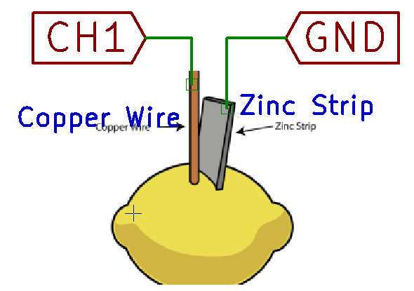
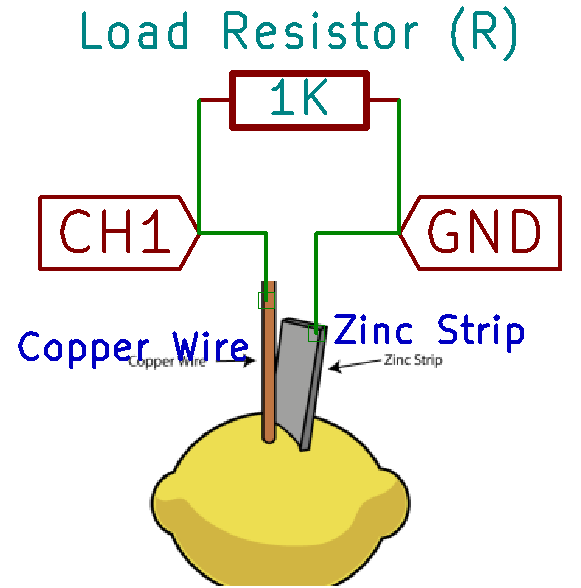
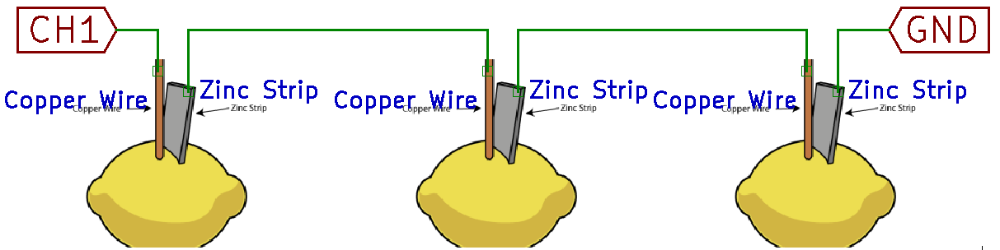
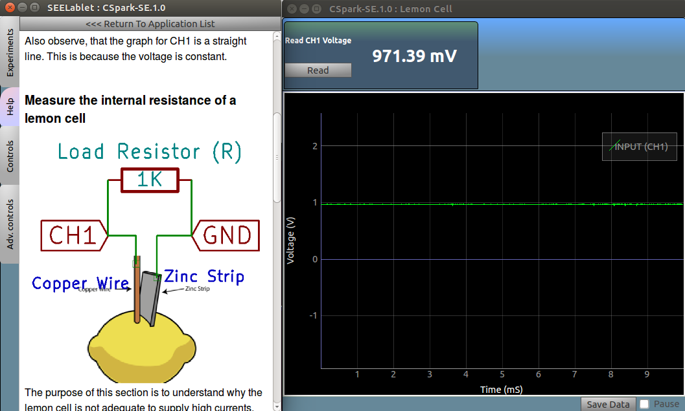

## Measure the voltage of a lemon cell

{: width="250px"}

Make the connections as shown in the figure. Use a copper wire, and a galvanized(coated with zinc) nail as the two electrodes. 
Observe the voltmeter for CH1 ,and note the values . Also observe, that the graph for CH1 is a straight line. This is because the voltage is constant.

## Measure the internal resistance of a lemon cell

{: width="250px"}

The purpose of this section is to understand why the lemon cell is not adequate to supply high currents.
Connect a 1000 (1K) Ohm resistor across the lemon cell, and observe that the voltage has now reduced.

This is a consequence of the internal resistance of the lemon cell, and using the measured voltage difference caused by connecting this resistor, we can calculate it.
The current flowing through the circuit with the load resistor connected, according to Ohm's law, is I = V/R = V(CH1)/1000 .
The voltage drop = ( V(CH1) without R connected - V(CH1) with R connected ) 
Internal resistance = voltage drop/current(I) 
	

Enter the measured values in the following boxes and click to calculate the internal resistance
<form name="form2">
V(CH1) without R  :<input type="text" size="20" name="v1">Volts 
V(CH1) with R  :<input type="text" size="20" name="v2">Volts 
Series Resistance :<input type="text" size="20" name="r1" value="1000">Ohms 
<input type="button" name="B1" value="Calculate" onclick="cal2()"> 
Internal Resistance:<input type="text" size="20" name="answer">Ohms 
</form>

	 

	
{: width="500px"}

Connect three lemon cells in series, and note the voltage. Try connecting an LED to this battery.
	
### Screenshot

