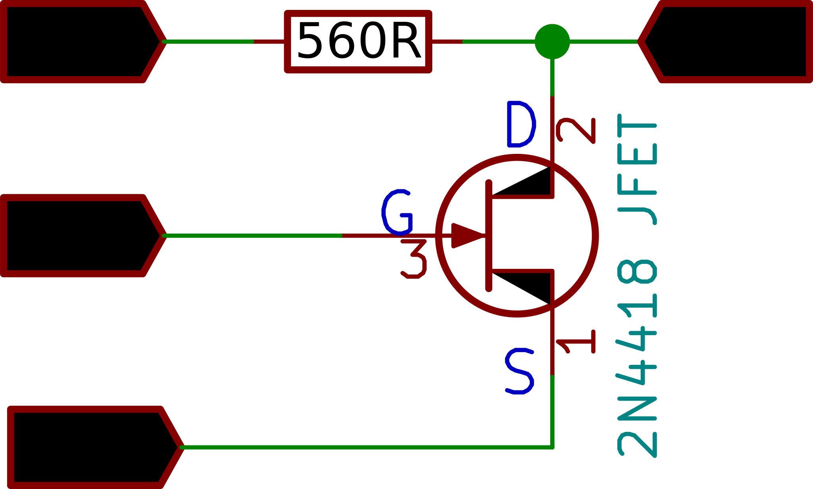
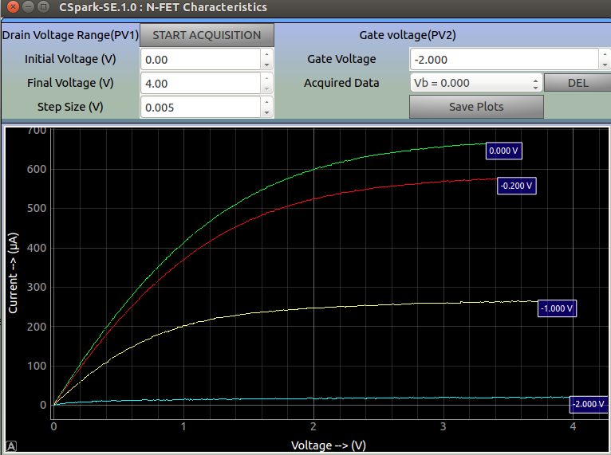

{: width="400px"}

## Dependence of drain current on D-S voltage, and Gate Voltage

Set the gate voltage for various values between 0, and -2 V , and observe the effect on saturation current 

PV1 is varied in steps, and for each step the current is calculated from the difference between voltages at PV1 and CH1, and the known value of the resistor(560 ohms)
Acquired plots can be selectively displayed or deleted. 

## screenshot

{: width="700px"}

