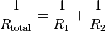

## Study how resistors behave in combination

Measure the values of the resistors by individually connecting them between SEN and GND, and note these. 

{: width="300px"}

## In Series

Connect the two resistors in series as shown below, and observe the combined resistance. Rtotal = R1+R2. 

{: width="300px"}

## In Parallel

Now connect them in parallel, and confirm that  

{: width="300px"}

{: width="300px"}

	


	

 
### .
