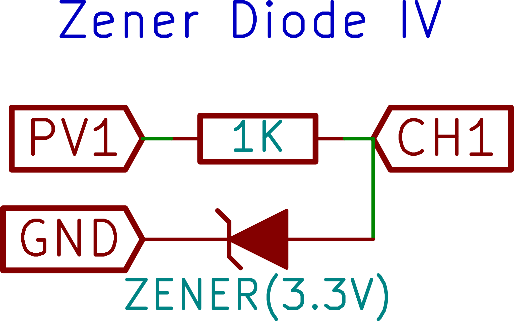
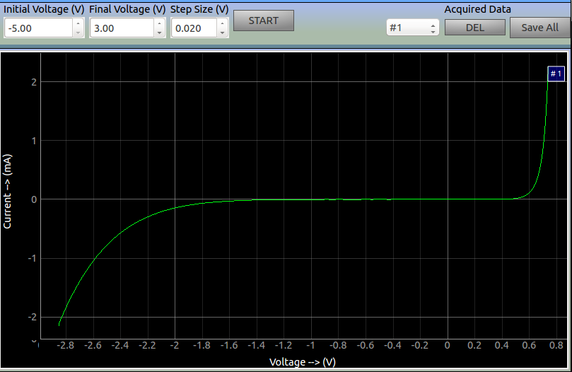

{: width="400px"}

Connect the Diode from CH1 to Ground.
Connect a 1k resistor from PV1 to CH1.

PV1 is varied in steps, and for each step the current is calculated from the difference between voltages at PV1 and CH1, and the known value of the resistor
Acquired plots can be selectively displayed or deleted.

## screenshot

{: width="700px"}

