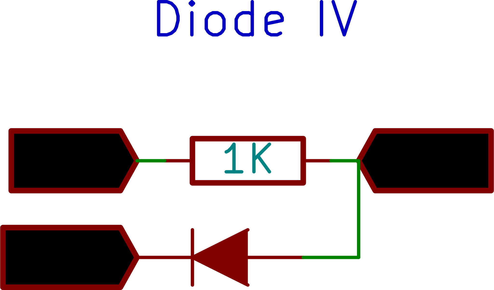

{: width="400px"}

Connect the Diode from CH3 to Ground.
Connect a 1k resistor from PV1 to CH3.

PV1 is varied in steps, and for each step the current is calculated from the difference between voltages at PV1 and CH3, and the known value of the resistor
Acquired plots can be selectively displayed or deleted.

