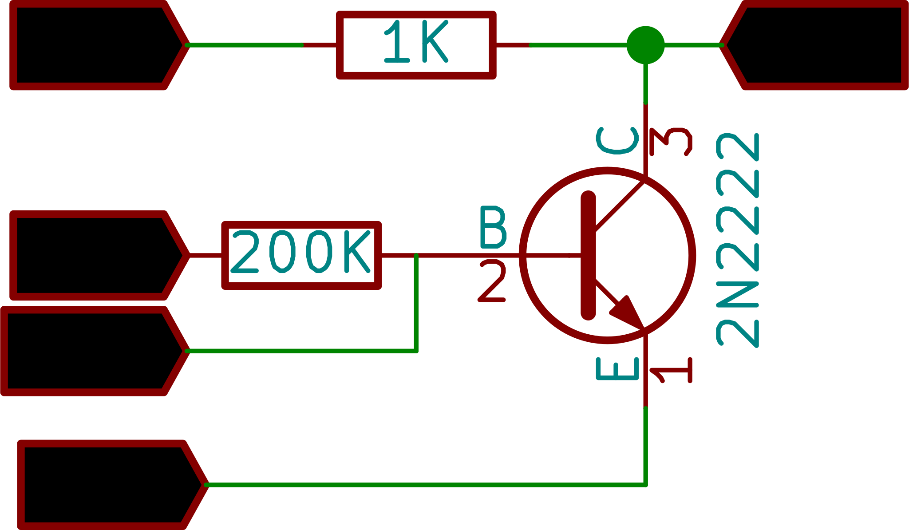

## Output Characteristics
{: width="300px"}

Make the connections as shown in the figure.

Select a voltage at PV2, for setting base current. This voltage, in combination with the 200K series resistor acts as a passive constant current source
the Collector voltage and current are measured by the program and plotted in real time.

An ammeter is not shown , but current is calculated using the measured voltage drop across the known resistor. I = (PV1-CH1)/1k

