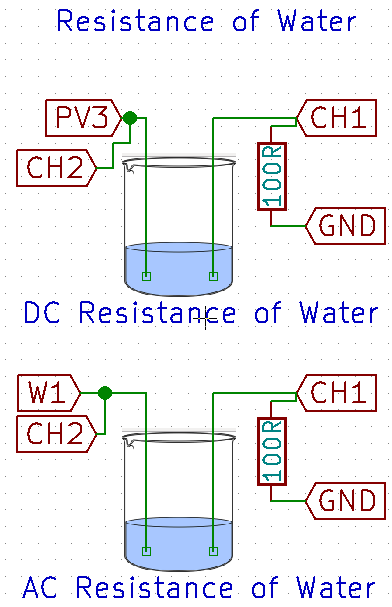

## Schematic 

{: width="400px"}

## DC resistance

Make the connections as shown in the figure.

The voltage output of PV3 has already been set to 2.0 Volts.

The voltage measured by CH1 will be proportional to the current flowing through the circuit, and since the water is connected in series with this circuit, this current must also flow through it.

## AC Resistance

This part uses a voltage source that is oscillating back and forth between 3.0 Volts, and -3.0 Volts. The frequency of oscillations can be set using the dial.

Connect W1 in place of PV3, and set its amplitude to maximum using the knob. Connect CH2 to W1 : This is to monitor its output simultaneously.

The amplitude of the graph for CH1 depicts the current flow. Is the amplitude dependent on the frequency of the input waveform? 

