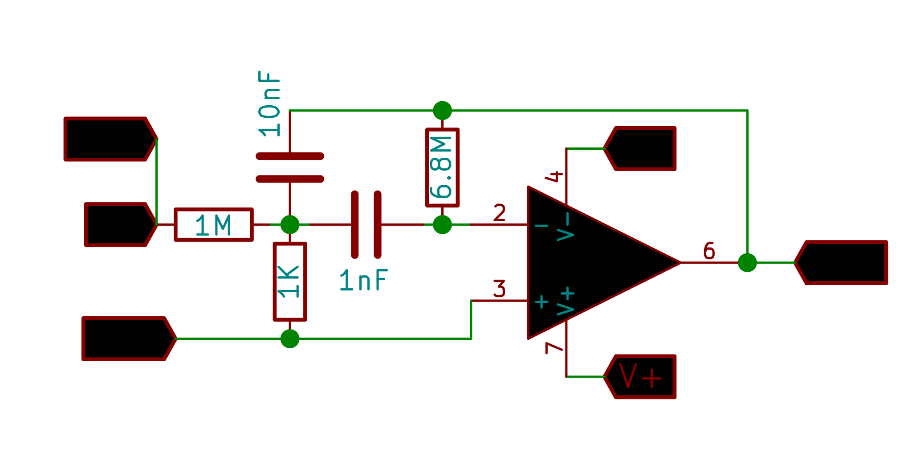

## Multiple Feedback Band-Pass Filter: 1.6 Khz 

{: width="400px"}

## Multiple Feedback Band-Pass Filter: 600 Hz 

{: width="400px"}

Make the Connections as shown in the figure.

CH1 monitors the original waveform output from W1.

CH2 monitors the filter's output .

Set the frequency range to study the behaviour in, and click on START .
The app then outputs a sine wave with an incrementing frequency on W1 which is connected to the input of the circuit under test.
The amplitudes and phases of the input and output waveforms are recorded for each frequency in order to obtain the bode plots.

## Screenshot

