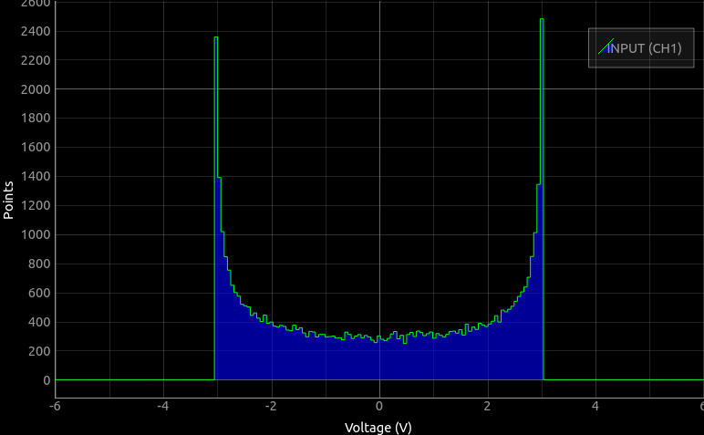
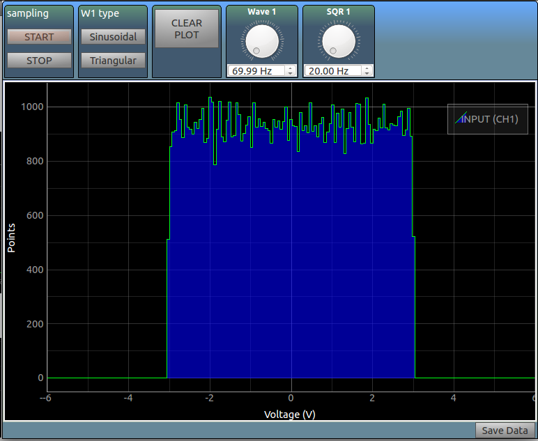
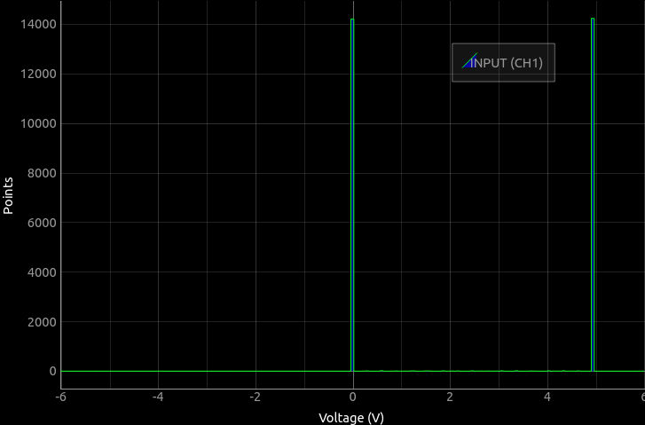

## Introduction

In this experiment, we will measure voltages of an input signal at random intervals, and plot a histogram that shows the time spent in each amplitude range.

For example, a sine wave spends maximum time at its extremities, so the histogram will have the highest peaks at either end, and the lowest ones near the mean.

Connect W1 to CH1, and run the experiment to characterize a sine/triangular wave, and then connect SQR1 to characterize a square wave

{: width="300px"}

## Sinusoidal Wave : Screenshot
{: width="600px"}

## Triangular Wave : Screenshot
{: width="600px"}

## Square Wave Wave : Screenshot
{: width="600px"}
