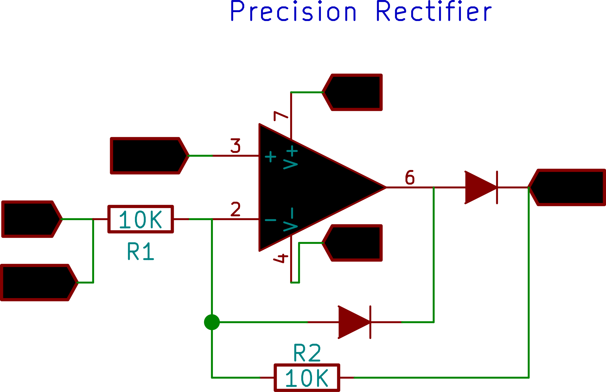

## Introduction

The precision rectifier, also known as a super diode, is a configuration obtained with an op-amp in order to have a circuit behave like an ideal diode and rectifier. 
This example shows half-wave rectification using this circuit. Notice how the peaks of both input and output coincide. In the simple diode based rectifier, the 0.6 volt forward threshold voltage causes a similar difference in the peak heights of the input and output waveforms.

{: width="300px"}

+ Make the Connections as shown in the figure.
+ CH1 monitors the original waveform output from W1.
+ CH2 monitors the rectified waveform .

Click anywhere on the plot to activate crosshairs, and note voltage values of the input and output peaks.

{: width="600px"}

