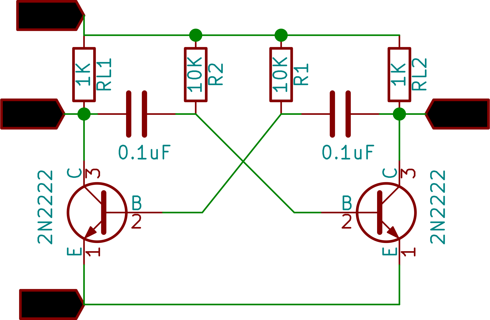
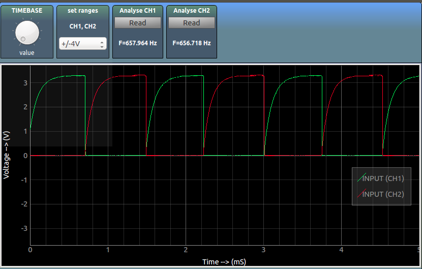

An astable-multivibrator circuit's output oscillates continuously between its two unstable states.

It does not require an external trigger, and the time period of each states are determined by the RC time constant

## Schematic 

{: width="400px"}

## Screenshot

## additional reading
[Tutorial](http://www.electronics-tutorials.ws/waveforms/astable.html)
