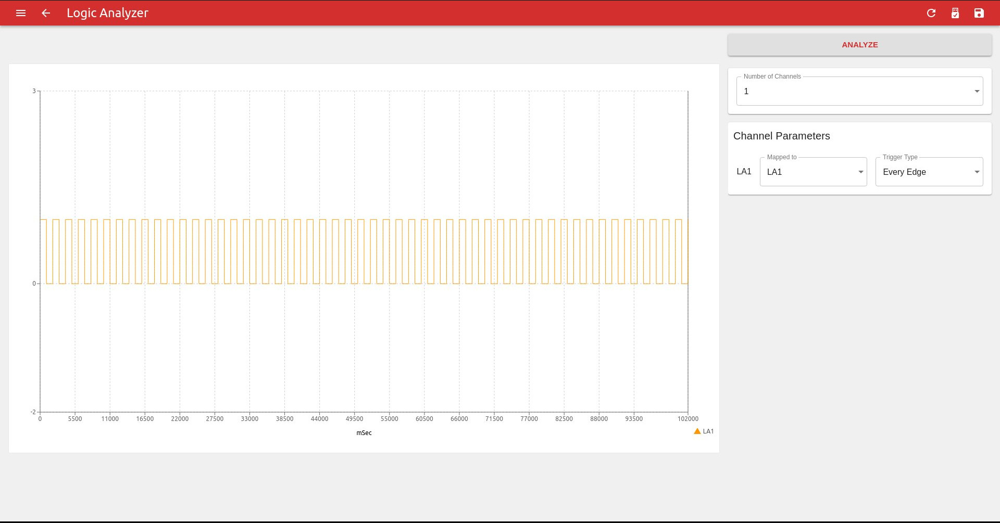
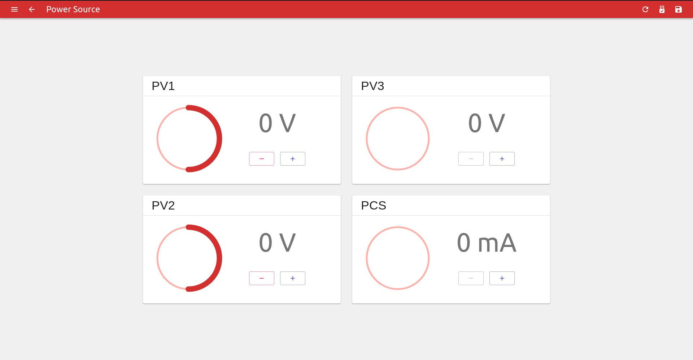
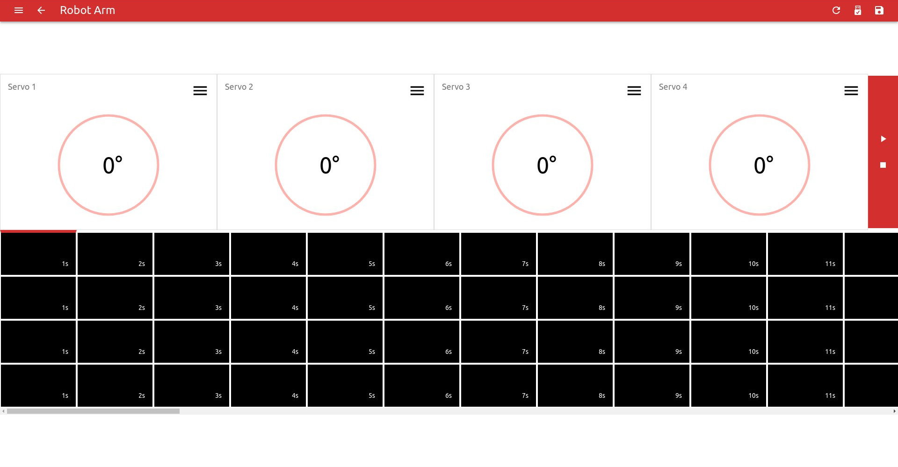
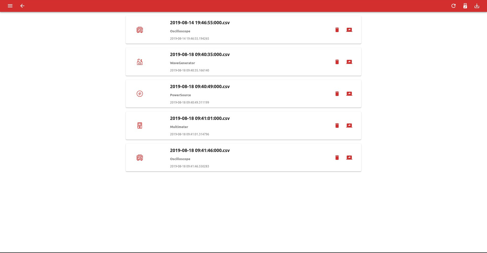
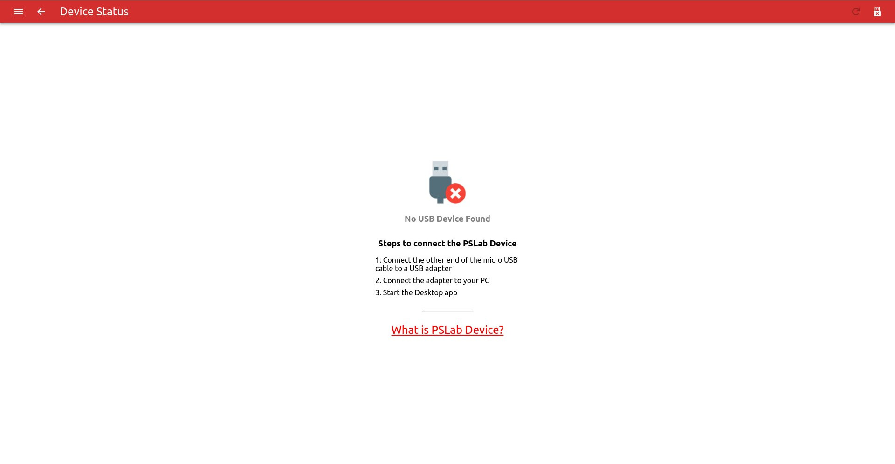

## Screenshots

<table>
  <tr>
   <td>
	 	  
	 	The home screen that showcases all our instruments.
	 </td>
	 <td>
	 	  
		A four channel oscilloscope with analysis features.
	</td>
	</tr>
	<tr>
   <td>
	   
	 A four channel Logic Analyzer for digital outputs.
	</td>
	<td>
	   
	 A full fledged multimeter that can measure voltage, frequency, resistance etc.
	</td>
	</tr>
	<tr>
   <td>
	 	  
		Instrument used to generate analoge and digital waves of different frequencies, phase and duty cycles. 
	 </td>
	 <td>
	    
	 A programmable voltage and current source to drive your external circuits.
	 </td>
	</tr>
	<tr>
   <td>
	 	   
		An intutive interface to control 4 servo motor robot arm.
	 </td>
	 <td>
	 	   
	  Save data and config in CSV and retrieve them back later.
	 </td>
	</tr>
	<tr>
   <td>
	 	   
		The app drawer gives you access to many more options like the FAQ, Device Information Screen etc.
	 </td>
	 <td>
	 	   
		A settings page for configuring your app as per your requirement.
	 </td>
	</tr>
	<tr>
   <td>
	 	   
		A device information screen that shows device information and guide to connect it to the app.
	 </td>
	 <td>
	 	   
		A new FAQ screen that covers all generic as well as app specific questions that a user may have.
	 </td>
	</tr>
	<tr>
   <td>
	 	   
		A page that has all the important links that can be used to reach out to us, or contribute to the project.
	 </td>
	</tr>
</table>

## Project Videos

[Project Overview](https://www.youtube.com/watch?v=0fVkTbNWDME)
